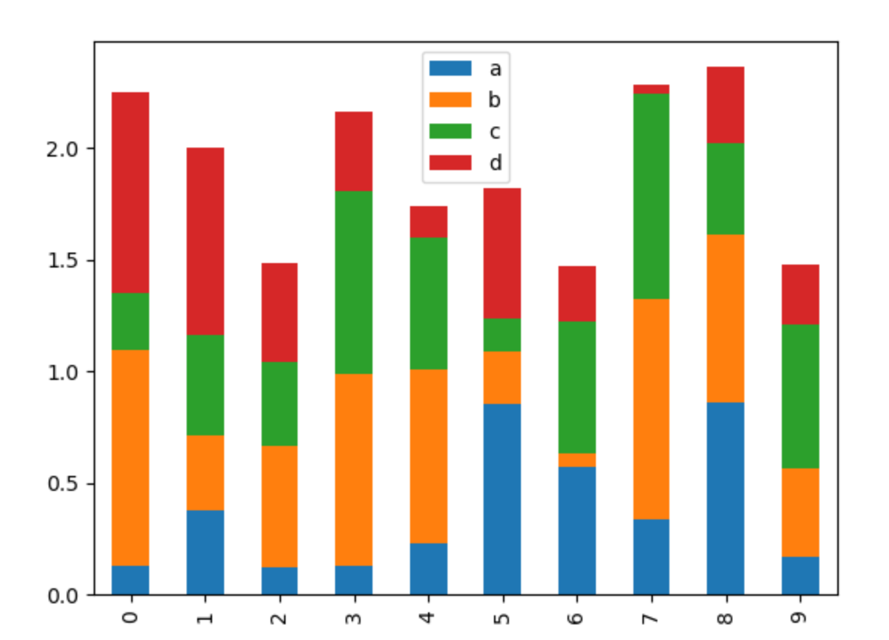

# 练习8-pandas简介

Date: 2024-12-14

## pandas基础

1. 依然是从[国家统计局网站](https://www.stats.gov.cn/zt_18555/ztsj/hjtjzl/1999/202303/t20230302_1923327.html)将**人口出生率、死亡率、自然增长率（2-表2）（1999年）**读为pandas.DataFrame表格
2. 将该表格以不同的方式展示
   - 直接输出
   - display
   - 显示数据行的前五行
   - 显示后五行
3. 分别绘制全国出生率、死亡率和自然增长率的折线图，横坐标为年份
4. 从[中国数据网](https://data.stats.gov.cn/easyquery.htm?cn=C01)查询1952年-1999年的全国总人口，将其与以上表格按照相同年份进行合并
5. 根据全国总人口与全国出生率，计算全国出生人口，并绘制折线图，横坐标为年份
6. 使用`apply&map`系列函数，将表格中所有表示比率的数据转换成0~1之间的格式，如30%转换为0.3

## 扩展

1. 了解pandas包的表格展示功能。[Documentation](https://pandas.pydata.org/docs/user_guide/style.html#)
2. 了解pandas包中诸如下图中堆叠柱状图的绘制。
