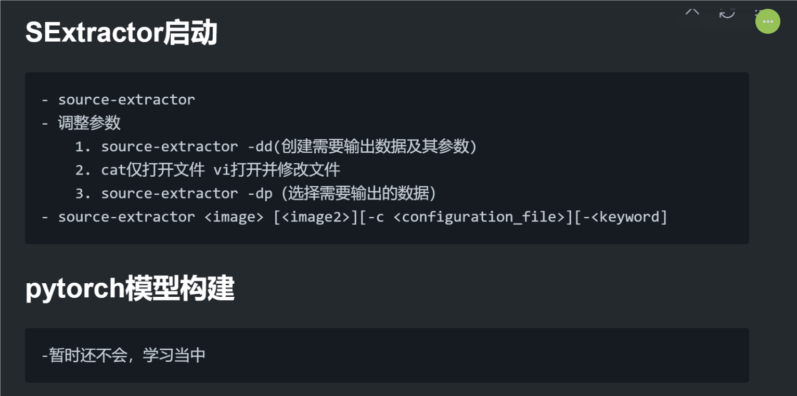
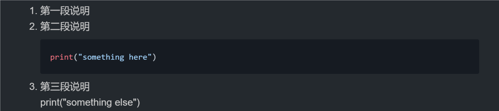

# week1

## docker启动

    - winpty docker run -it ubuntu-sex
    - 将代码复制到Ubuntu-Sextractor文件夹中进行使用
    - 需注意改动Dockerfile文件之后，要重新构建环境

## SExtractor启动

    - source-extractor
    - 调整参数
        1. source-extractor -dd(创建需要输出数据及其参数)
        2. cat仅打开文件 vi打开并修改文件
        3. source-extractor -dp（选择需要输出的数据）
    - source-extractor <image> [<image2>][-c <configuration_file>][-<keyword]

## pytorch模型构建

    -暂时还不会，学习当中

## 评价

### markdown

很好，用了新的markdown格式！

可以实验一下不同的markdown格式用法，比如经典的`引用`，**加粗**，$Formula^{extra}$等

提示一下，markdown的每个标题下在格式上不需要缩进，当然你愿意缩进也行。但是没有前置内容的空缩进会有格式问题，比如部分编译器会把空缩进的列表编译成代码块，而有前置内容的一般缩进会默认为上一部分的子内容，比如

1. 第一段说明
2. 第二段说明

   ```Python
   print("something here")
   ```

3. 第三段说明
    print("something else")

在我这边编译的结果可以见下图。




### docker

感觉平平常常，会用就行，如果再有什么问题再随时交流。
